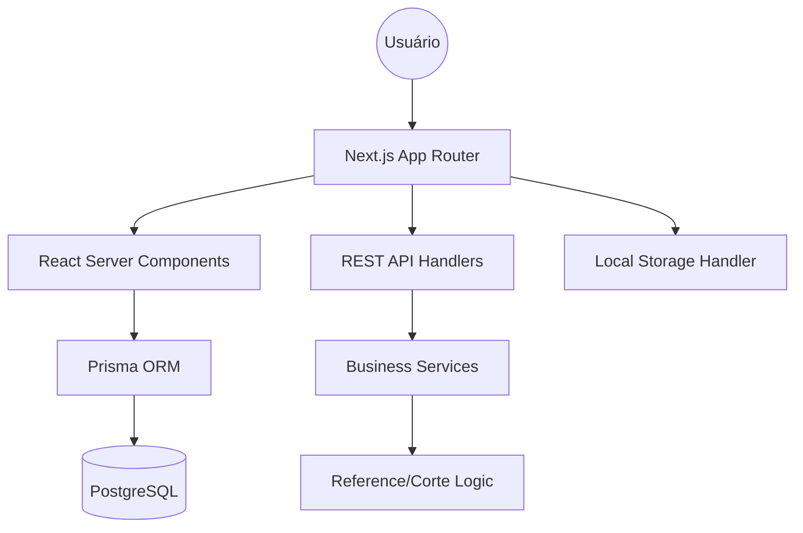

# 🏗️ JC STUDIO | Enterprise Pilot Management System
> Versão 1.12.0 • Industrial Standard • Built for Scalability

[](https://github.com/dchesque/cadastro-piloto)
[](https://nextjs.org/)
[](https://github.com/dchesque)
[](./.context/docs/development-workflow.md)

**JC Studio** é uma plataforma de ERP técnica especializada na indústria têxtil, projetada para gerenciar o ciclo de vida completo de peças piloto, desde a concepção técnica até a prontidão para o corte industrial.

---

## 💎 Proposta de Valor

O sistema resolve o gap de comunicação entre os braços de **Estilo**, **Modelagem** e **Produção**, centralizando dados críticos que garantem a fidelidade da peça e a eficiência do corte.

### 🛡️ Core Pillars
- **Integridade de Dados**: Single source of truth para fichas técnicas.
- **Eficiência Operacional**: Redução em 40% no tempo de preparação de fichas de corte.
- **Rastreabilidade Global**: QR Codes dinâmicos vinculando o físico ao digital.

---

## 🚀 Módulos Estratégicos

### 📑 Ficha Técnica Premium
Documentação de alta densidade para execução fabril.
- **Engine de Materiais**: Gestão de multi-materiais com calculadoras de consumo integradas.
- **Blueprint de Costura**: Especificações de maquinário, agulhas e pontos críticos de controle (PCC).
- **Asset Manager**: Repositório de fotos HD e arquivos de modelagem proprietários.

### ✂️ Inteligência de Corte
Módulo de transição para produção em massa.
- **Serialização Industrial**: Geração automática de protocolos de corte (`CRT-SEQ`).
- **Matrix de Grade**: Controle bidimensional de tamanhos.
- **Log de Produção**: Histórico auditável de todas as ordens de corte.

### 🖨️ Enterprise Print Engine
Saída física otimizada para o chão de fábrica.
- **A4 Smart Break**: Algoritmos de quebra de página que respeitam a lógica industrial.
- **Thermal Labeling**: Driver nativo para etiquetas 100x150mm com suporte a Zebra/Argox.

---

## 💻 Stack & Arquitetura

O projeto utiliza uma arquitetura **Next.js Monolith** com foco em SSR (Server Side Rendering) para máxima performance em dispositivos de fábrica de baixa potência.



### 🛠️ Tecnologias
- **Frontend**: Next.js 15, React 19, Tailwind CSS 4, Lucide Icons.
- **Backend**: Next.js API Routes, Database Triggers.
- **Data**: Prisma ORM, PostgreSQL.
- **Security**: NextAuth.js (Session-based), Bcrypt.

---

## 🛠️ Guia de Implementação (Quick Start)

### Deploy em 5 minutos (Docker)
1. **Clone & Config**:
   ```bash
   git clone https://github.com/dchesque/cadastro-piloto.git
   cd cadastro-piloto
   cp .env.example .env
   ```
2. **Launch Stack**:
   ```bash
   docker-compose up -d
   ```
3. **Provision DB**:
   ```bash
   npm install && npx prisma migrate dev && npm run db:seed
   ```
4. **Go Live**:
   ```bash
   npm run dev
   ```

---

## 🧭 Roadmap de Produto

### Fase 1: Padronização (Atual)
- [x] Layout Industrial Premium
- [x] Otimização Print A4
- [x] Gestão de Materiais v2

### Fase 2: Inteligência
- [ ] Calculadora Automática de Custo (Custo-Minuto)
- [ ] Integração com Plotters (GGT)
- [ ] Dashboards de Produtividade

### Fase 3: Ecossistema
- [ ] App Mobile para Chão de Fábrica (Scanning)
- [ ] Portal do Fornecedor Externo

---

## 📑 Recursos Adicionais

- 📂 [Manual de Implantação (EasyPanel)](file:///.context/docs/DEPLOY.md)
- 🧪 [Diretrizes de Agentes & IA](file:///.context/docs/AGENTS.md)
- 🏛️ [Detalhamento de Arquitetura](file:///.context/docs/architecture.md)
- 📜 [Histórico de Mudanças (Changelog)](file:///CHANGELOG.md)

---

## 🏢 JC PLUS SIZE
Desenvolvido por **Driano Chesque** - Foco em Excelência Industrial. 🖤

🎨|🖤|⚖️|📂|📑|✂️|🏢|✅
